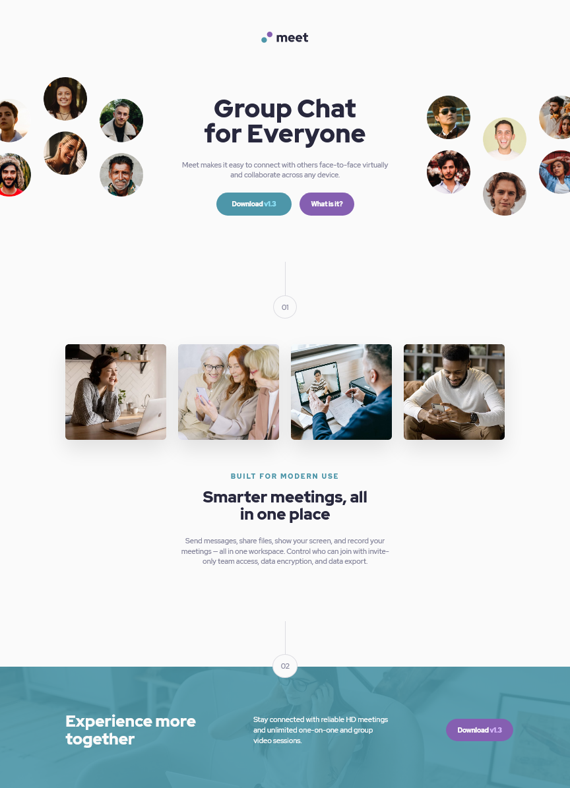

# Meet - Responsive Landing Page

"Meet" is a hypothetical messagaing and video calling platform that makes it easy to connect with others face-to-face virtually and collaborate across any device.

## Table of contents

- [Overview](#overview)
  - [The challenge](#the-challenge)
  - [Screenshot](#screenshot)
  - [Links](#links)
- [My process](#my-process)
  - [Built with](#built-with)

## Overview

### The challenge

Users should be able to:

- View the optimal layout depending on their device's screen size, including desktop, tablet, and mobile (e.g. responsive design)
- See hover states for interactive elements (e.g. buttons)

### Screenshot

Desktop Layout

### Links

- Live Site URL: [https://ryanjsheehan1.github.io/meet/](https://ryanjsheehan1.github.io/meet/)

## My process

### Built with

- Semantic HTML5 markup
- CSS custom properties
- Flexbox
- CSS Grid
- Sass
- Desktop-first workflow
